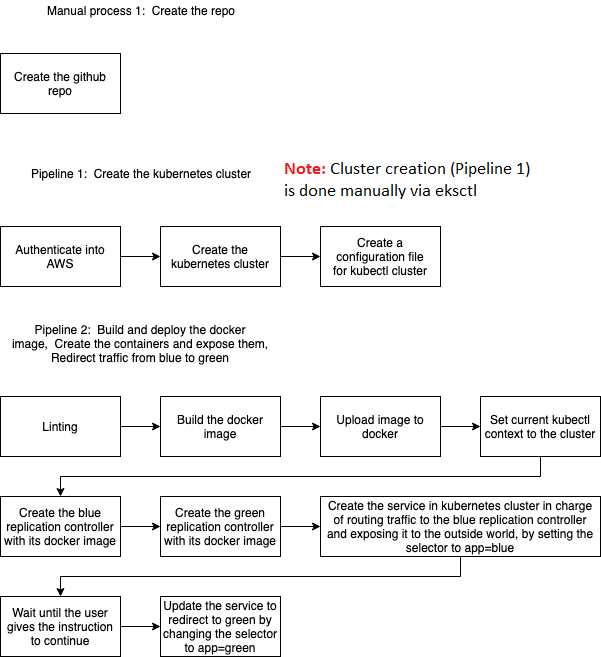

# Udacity DevOps Nanodegree: Capstone Project

This project provides Pipeline 2 as detailed in the flowchart below. I skipped Pipeline 1 and created the cluster manually (see image and cf. section **EKS cluster** below for infos) because I cannot see a reason why this one-time creation process should be managed by Jenkins. The chosen procedure is backed by Alvaro Anres Pinzon Cortes' answers to several questions in Udacity Knowledge ([1](https://knowledge.udacity.com/questions/190852), [2](https://knowledge.udacity.com/questions/127383)).

> Please note that the flowchart has been provided by Alvaro Andres Pinzon Cortes in his [FAQ for the DevOps Capstone](https://medium.com/@andresaaap/capstone-cloud-devops-nanodegree-4493ab439d48).



## Preparing starter code

> I use the following repository as starter code for a blue-green deployment: https://github.com/andresaaap/tutorial-green-blue-deploy-minikube. I would like to thank the Udacity mentor Alvaro Andres Pinzon Cortes for providing this helpful repository!

I make some minor adjustments below:

- `git clone git@github.com:andresaaap/tutorial-green-blue-deploy-minikube.git`
- `cd tutorial-green-blue-deploy-minikube`
- `find . -type f -name '*.sh' -print0 | xargs -0 dos2unix` (if you don't have `dos2unix` on your system, type `sudo apt-get install dos2unix` first)
- `find . -type f -name "*.html" -print0 | xargs -0 sed -i -e 's/Hello World, my name is Alvaro Pinzon/Hello world, my name is thrld!/g'`
- Now try to build and run the green container: `cd green && ./run_docker.sh`. Open http://localhost:8000/ in your browser to verify. Note that you have to `cd` first, since the `docker build` command in `run_docker.sh` will look for a `Dockerfile` in your current directory. 
- Exit with `Ctrl + C` and run the blue container: `cd ../blue && ./run_docker.sh`. Open http://localhost:8000/ in your browser to verify.
- Next, I manually cleaned up `./green/upload_docker.sh` and `./blue/upload_docker.sh` and provided the correct Docker user and paths. To test, call `cd green && ./upload_docker.sh` and `cd blue && ./upload_docker.sh`. The two images should now be uploaded and accessible from DockerHub.

> Note that the `.sh` scripts in the folder `blue_green_static_html` are for local testing purposes only. In the `Jenkinsfile` I prefer to be verbose so that I know what each step is doing.

## Prepare the main EC2 instance

- Install...
    - Jenkins plus required plug-ins
    - Docker: After the installation, make sure to add the `jenkins` user to the Docker user group and restart Jenkins.
    ```
    sudo usermod -a -G docker jenkins
    sudo systemctl restart jenkins
    ```
    - `kubectl`
    - AWS CLI: Make sure that Jenkins can use AWS!
    ```
    curl "https://awscli.amazonaws.com/awscli-exe-linux-x86_64.zip" -o "awscliv2.zip"
    sudo apt install unzip
    unzip awscliv2.zip
    sudo ./aws/install
    export PATH=/usr/local/bin:$PATH
    ```
    - `eksctl`

## EKS cluster

I use `eksctl` to create an EKS cluster. For an introduction to `eksctl`, see the [documentation](https://docs.aws.amazon.com/eks/latest/userguide/getting-started-eksctl.html). The nodes seem to receive 80GB of disk space by default. Hence, I choose an appropriate value (`--node-volume-size 10`, in GB), given this is just a toy project.

```
eksctl create cluster \
    --name udac-cluster \
    --version 1.16 \
    --region us-east-2 \
    --nodegroup-name udac-workers \
    --node-type t2.micro \
    --node-volume-size 10 \
    --nodes 2 \
    --nodes-min 2 \
    --nodes-max 2 \
    --ssh-access \
    --managed
```

> **Note to reviewers:** `eksctl` uses CloudFormation under the hood, so this should be fine (also see [this Udacity Knowledge thread](https://knowledge.udacity.com/questions/159823)).

> *What are my options for `--ssh-public-key`?*
>
>You can either provide a path to a local public key or the name of pre-existing EC2 key pair (note that the regions have to match!). If you do not provide one, `eksctl` imports `~/.ssh/id_rsa.pub`. Read more [here](https://eksctl.io/introduction/#ssh-access). If you got everything right, you should be able to SSH into the EC2 instances spun up by EKS using the key you specified.

## Accessing the EKS cluster via EC2/Jenkins

> **Important note:** If you did it like me and created the cluster on your local machine with a more priviliged IAM user, you will have a hard time issuing `kubectl` commands with the IAM user that you use inside Jenkins. What you will see in this case is:  `error: You must be logged in to the server (Unauthorized)`. But fear not, [here](https://aws.amazon.com/premiumsupport/knowledge-center/eks-api-server-unauthorized-error/) is how to fix it.

- Next, let's add the new k8s context to `/home/<your-usr>/.kube/config` by typing: `aws eks --region us-east-2 update-kubeconfig --name udac-cluster`.
- Make the file accessible to the Jenkins user:
```
sudo mv ~/.kube/config /var/lib/jenkins
sudo chown -R jenkins $HOME/ .kube/
```
- After verifying that the we are issuing are `kubectl` commands to the right cluster (`kubectl config current-context`), we are finally ready to issue some `kubectl apply` statements:
```
kubectl apply -f blue/blue-controller.json
kubectl apply -f green/green-controller.json
kubectl apply -f blue-green-service.json
```
- The last command should have created our service, let us look for the external IP: `kubectl get svc bluegreenlb`. If everything went well, you can now access the site in your browser via `<EXTERNAL-IP>:8000` (where `8000` is the port we specified in the service).

## Running the Pipeline

Once you create the pipeline in Jenkins, the `Jenkinsfile` will be picked up. I configured the pipeline to check for commits every minute so that a build is triggered automatically whenever I push new code to my repository.

## Deleting the EKS cluster

[Here](https://docs.aws.amazon.com/eks/latest/userguide/delete-cluster.html) is the relevant section in the AWS docs.

- First, we have to delete all services with an external IP. So let us list all services first: `kubectl get svc --all-namespaces`. Let us say we found one service with an external IP in the `default` namespace with the name `delete-me`, then delete via `kubectl delete svc`.
- Now type `eksctl delete cluster -r us-east-2 -n prod` to delete the cluster.

> Sometimes this command fails with a `Dependency Violation` (see [this discussion](https://github.com/weaveworks/eksctl/issues/1849)). In my case, it helped to delete dangling ENI(s) as suggested [here](https://github.com/weaveworks/eksctl/issues/1849#issuecomment-628879572). Once this is done, simply re-run the `eksctl delete cluster` command.
